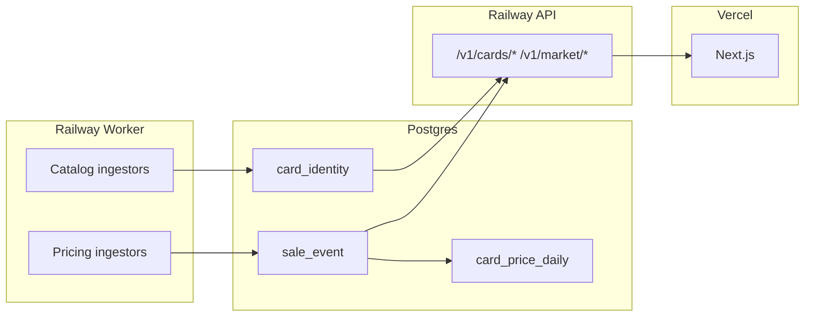

# Live data & Stripe setup audit

Date: 2026-06-15  
Scope: Backend-first integration readiness for Stripe subscriptions and TCG data sources.  
**No schema rewrites applied in this pass** — audit + env checklist only.

---

## Architecture rules (locked)

| Rule | Status |
|------|--------|
| Frontend never calls Stripe secrets, eBay, Reddit, Apify, Cardmarket, or other external APIs | ✅ Enforced — web uses `@tcgscan/sdk-ts` → Railway API only |
| All secrets in Railway only | ✅ Stripe/eBay/TCG keys in `apps/api` + `apps/worker` env |
| Vercel gets `NEXT_PUBLIC_*` only | ✅ No secret keys in web bundle |
| Backend/Railway handles external APIs | ✅ Worker ingests; API reads Postgres |
| Database stores normalised card/listing/price data | ✅ `card_identity` + `sale_event` + `card_price_daily` |
| Background jobs refresh live data | ✅ Temporal + CLI in `apps/worker` |

---

## Quick answer: what keys to add now

### Railway — API service (`apps/api`)

**Already required (auth — you have these):**

| Variable | Purpose |
|----------|---------|
| `DATABASE_URL` | Postgres |
| `ENVIRONMENT=production` | Disables dev auth bypass |
| `CORS_ORIGINS` | `https://cardchart.co.uk,https://www.cardchart.co.uk` |
| `SUPABASE_URL` | JWT issuer |
| `SUPABASE_JWT_SECRET` or `SUPABASE_JWKS_URL` | Verify Bearer tokens |
| `REDIS_URL` | Rate limits / scan quotas |

**Add for Stripe (billing):**

| Variable | Code name | Notes |
|----------|-----------|-------|
| `STRIPE_SECRET_KEY` | `sk_live_...` or `sk_test_...` | Required for checkout/portal/webhook |
| `STRIPE_WEBHOOK_SECRET` | `whsec_...` | From Stripe Dashboard → Webhooks → `/v1/billing/webhook` |
| `STRIPE_PRO_PRICE_ID` | `price_...` | **Not** `STRIPE_PRICE_ID_PRO_MONTHLY` — code uses this exact name |
| `STRIPE_SUCCESS_URL` | `https://cardchart.co.uk/account?checkout=success` | Redirect after Checkout |
| `STRIPE_CANCEL_URL` | `https://cardchart.co.uk/account?checkout=cancel` | Redirect on cancel |

**Optional API vars (search URL host only — no live eBay calls from API):**

| Variable | Default | Notes |
|----------|---------|-------|
| `EBAY_MARKETPLACE_ID` | `EBAY_GB` | Used for outbound search link host (`ebay.co.uk` vs `ebay.com`) |

**Not needed on API for pricing ingest** (worker-only): `EBAY_OAUTH_TOKEN`, `TCG_API_KEY`, `APIFY_TOKEN`, `POKEMONTCG_API_KEY`.

---

### Railway — Worker service (`apps/worker`)

Run as a separate Railway service (or cron) with same `DATABASE_URL` + Temporal/Redis as configured.

**Catalog ingest (metadata):**

| Variable | Required? | Source |
|----------|-----------|--------|
| `POKEMONTCG_API_KEY` | Optional | [pokemontcg.io](https://dev.pokemontcg.io) — higher rate limits |
| *(none)* | — | Scryfall, YGOPRODeck, OPTCG, Lorcast work without keys |

**Pricing ingest (live market data):**

| Variable | Required? | Source |
|----------|-----------|--------|
| `EBAY_OAUTH_TOKEN` | One of OAuth pair | Pre-minted token **or** use app id + cert |
| `EBAY_APP_ID` + `EBAY_CERT_ID` | Alternative to token | eBay Developer → OAuth client credentials |
| `EBAY_INSIGHTS_TOKEN` | Recommended for sold comps | Marketplace Insights (limited release) |
| `EBAY_MARKETPLACE_ID` | Yes | `EBAY_GB` (default) or `EBAY_US` |
| `TCG_API_KEY` | For TCGPlayer proxy | [tcgapi.dev](https://tcgapi.dev) |
| `APIFY_TOKEN` | For Cardmarket fallback | Apify account |
| `APIFY_CARDMARKET_DATASET_ID` | Optional | Default `cardmarket-trend` — dataset must be populated externally |

**Worker infra:**

| Variable | Purpose |
|----------|---------|
| `DATABASE_URL` | Write `sale_event`, upsert `card_identity` |
| `TEMPORAL_ADDRESS` | Scheduled workflows |
| `REDIS_URL` | Optional worker caches |

**Not implemented — do not add yet (no code reads them):**

| Variable | Status |
|----------|--------|
| `EBAY_DEV_ID` | In `.env.example` only — unused |
| `EBAY_AFFILIATE_TRACKING_ID` / EPN campid | Documented only — **no affiliate URL builder** |
| `REDDIT_CLIENT_ID` / `REDDIT_CLIENT_SECRET` | **No Reddit integration** |

---

### Vercel — Web (`apps/web`)

| Variable | Required? | Purpose |
|----------|-----------|---------|
| `NEXT_PUBLIC_API_URL` | ✅ | `https://tcg-scan-web-app-production.up.railway.app` |
| `NEXT_PUBLIC_SUPABASE_URL` | ✅ | Supabase project URL |
| `NEXT_PUBLIC_SUPABASE_ANON_KEY` | ✅ | Supabase anon key |
| `NEXT_PUBLIC_SITE_URL` | ✅ | `https://cardchart.co.uk` |
| `NEXT_PUBLIC_SCAN_ENABLED` | Optional | Feature flag |

**Do not set on Vercel:**

- `STRIPE_SECRET_KEY`, `STRIPE_WEBHOOK_SECRET`, `STRIPE_PRO_PRICE_ID` — Railway only
- `NEXT_PUBLIC_STRIPE_PUBLISHABLE_KEY` — in `.env.example` but **unused** (redirect Checkout flow, no Stripe.js)
- `NEXT_PUBLIC_DEV_AUTH_ENABLED` — leave unset in production

---

## Part 1: Stripe audit

### What already exists

| Component | File | Status |
|-----------|------|--------|
| Checkout | `POST /v1/billing/checkout` → `services/billing.py::create_checkout_session` | ✅ Implemented |
| Customer Portal | `POST /v1/billing/portal` → `create_portal_session` | ✅ Implemented |
| Webhook | `POST /v1/billing/webhook` → `handle_stripe_webhook` | ⚠️ Partial |
| User link | `users.stripe_customer_id`, metadata `user_id` + `supabase_user_id` on Stripe Customer | ✅ Implemented |
| Tier storage | `users.tier` (`free` \| `pro`) | ✅ Implemented |
| Pro gating (API) | `services/tier.py`, portfolio/watchlist/alerts/digest/market/scan limits | ✅ Enforced server-side |
| Account UI | `apps/web/src/app/account/account-client.tsx` → `startCheckout()` / `openBillingPortal()` | ✅ Implemented |
| SDK | `packages/sdk-ts` — `startCheckout`, `openBillingPortal`, `getAccount` | ✅ Implemented |

### Webhook events — coded vs required

| Event | Required | Coded? | Behaviour today |
|-------|----------|--------|-----------------|
| `checkout.session.completed` | ✅ | ✅ | Sets `tier=pro` if `metadata.user_id` present |
| `customer.subscription.created` | ✅ | ✅ | Sets `tier=pro` if `metadata.user_id` present |
| `customer.subscription.updated` | ✅ | ⚠️ | Sets `tier=pro` for **any** update — ignores `status` (`past_due`, `canceled`, etc.) |
| `customer.subscription.deleted` | ✅ | ✅ | Sets `tier=free` via `stripe_customer_id` lookup |
| `invoice.paid` | ✅ | ❌ | Not handled |
| `invoice.payment_failed` | ✅ | ❌ | Not handled |

### Missing / gaps (do not block test-mode launch, block production hardening)

| Gap | Risk |
|-----|------|
| No `users.subscription_status` column | Cannot distinguish `active` / `past_due` / `canceled` locally |
| No `users.stripe_subscription_id` column | Cannot reconcile subscription without Stripe API |
| `customer.subscription.*` metadata may lack `user_id` | Upgrade path relies heavily on `checkout.session.completed` |
| No `invoice.paid` / `invoice.payment_failed` handlers | Failed payments may leave user on Pro |
| No billing tests in `apps/api/tests/` | Regressions untested |
| Env name mismatch | Docs say `STRIPE_PRICE_ID_PRO_MONTHLY`; **code reads `STRIPE_PRO_PRICE_ID`** |
| Admin MRR | Hardcoded `$9.99`; `churn_30d` = 0 in admin repo |

### Stripe webhook setup (Railway)

1. Stripe Dashboard → Developers → Webhooks → Add endpoint  
   URL: `https://tcg-scan-web-app-production.up.railway.app/v1/billing/webhook`
2. Events to enable (minimum):  
   `checkout.session.completed`, `customer.subscription.created`, `customer.subscription.updated`, `customer.subscription.deleted`, `invoice.paid`, `invoice.payment_failed`
3. Copy signing secret → Railway `STRIPE_WEBHOOK_SECRET`
4. Create Product + monthly Price → copy `price_...` → Railway `STRIPE_PRO_PRICE_ID`

### Test commands (Stripe)

```bash
# Local (Stripe CLI forwards webhooks)
stripe listen --forward-to localhost:8000/v1/billing/webhook

# API health (no Stripe needed)
curl http://localhost:8000/v1/health

# Checkout (requires auth Bearer + STRIPE_SECRET_KEY + STRIPE_PRO_PRICE_ID)
curl -X POST http://localhost:8000/v1/billing/checkout \
  -H "Authorization: Bearer <supabase_access_token>"

# Account tier after webhook
curl http://localhost:8000/v1/me -H "Authorization: Bearer <token>"
```

**Failure if keys missing:** Checkout/portal return `503 Stripe is not configured`. Webhook returns `503 Webhook secret not configured`.

---

## Part 2: External data source audit

### Summary matrix

| Source | Coded? | Where | Railway vars | Vercel vars | API route (reads DB) | Worker job |
|--------|--------|-------|--------------|-------------|----------------------|------------|
| eBay Browse | ✅ | `worker/sources/ebay_active.py`, `ebay_sold.py` | `EBAY_*` | — | `/v1/cards/{id}/comps`, `/listings`, `/market/sales` | `ingest:pricing`, Temporal 15m/1h |
| eBay EPN affiliate | ❌ | Docs only | *(none)* | — | Raw listing URLs today | — |
| Pokémon TCG API | ✅ | `worker/catalog/pokemon.py` | `POKEMONTCG_API_KEY` optional | — | `/v1/cards/{slug}` (catalog) | `ingest:catalog --game pokemon` |
| Scryfall (MTG) | ✅ | `worker/catalog/mtg.py` | — | — | same | `ingest:catalog --game mtg` |
| YGOPRODeck | ✅ | `worker/catalog/yugioh.py` | — | — | same | `ingest:catalog --game yugioh` |
| OPTCG (One Piece) | ✅ | `worker/catalog/one_piece.py` | — | — | same | `ingest:catalog --game one_piece` |
| Lorcast | ✅ | `worker/catalog/lorcana.py` | — | — | same | `ingest:catalog --game lorcana` |
| tcgapi.dev (TCGPlayer) | ✅ | `worker/sources/tcgplayer.py` | `TCG_API_KEY` | — | `/v1/cards/{id}/sources` | `ingest:pricing`, daily |
| Cardmarket (Apify dataset) | ⚠️ Partial | `worker/sources/cardmarket.py` | `APIFY_TOKEN`, `APIFY_CARDMARKET_DATASET_ID` | — | `/v1/cards/{id}/sources` | daily pricing workflow |
| Cardmarket official API | ❌ | Closed to new apps | — | — | Search URL builder only | — |
| Reddit trends | ❌ | Not implemented | — | — | — | — |

---

### eBay Browse API

| Item | Detail |
|------|--------|
| **Code** | `apps/worker/tcgscan_worker/sources/ebay_auth.py`, `ebay_active.py`, `ebay_sold.py` |
| **Provides** | Active listings + sold comps → `sale_event` (`kind=listing` / `kind=sold`) |
| **Railway vars** | `EBAY_OAUTH_TOKEN` **or** `EBAY_APP_ID` + `EBAY_CERT_ID`; `EBAY_INSIGHTS_TOKEN` for real sold data; `EBAY_MARKETPLACE_ID` |
| **Vercel vars** | None |
| **Rate limit** | httpx client + token bucket in `worker/http.py` |
| **Cache** | Postgres `sale_event`; refresh via Temporal |
| **Test** | `uv run pytest apps/worker/tests/test_sources.py -q` |
| **Missing key** | Sold ingest falls back to Browse active search (not true sold comps — logged warning) |
| **Failure** | Skips source; existing DB data served; admin data-health shows `stale`/`down` |

### eBay Partner Network (affiliate links)

| Item | Detail |
|------|--------|
| **Code** | **None** — raw `itemWebUrl` stored and displayed |
| **Provides** | Should add `campid`/`customid`/`mkevt` to outbound links |
| **Railway vars** | Not defined — propose `EBAY_EPN_CAMPAIGN_ID`, `EBAY_EPN_CUSTOM_ID` when implemented |
| **Vercel vars** | None |
| **Test** | N/A |
| **Failure** | Non-affiliate links (revenue leak, not outage) |

### Pokémon TCG API (pokemontcg.io)

| Item | Detail |
|------|--------|
| **Code** | `apps/worker/tcgscan_worker/catalog/pokemon.py` |
| **Provides** | Card/set metadata → `card_identity` |
| **Railway vars** | `POKEMONTCG_API_KEY` (optional, `X-Api-Key`) |
| **Vercel vars** | None |
| **Rate limit** | 20 req/s with key; lower without |
| **Test** | `uv run pytest apps/worker/tests/test_catalog.py -k pokemon -q` |
| **CLI** | `pnpm ingest:catalog -- --game pokemon` |
| **Missing key** | Still works; slower rate limit |

### Scryfall (MTG)

| Item | Detail |
|------|--------|
| **Code** | `apps/worker/tcgscan_worker/catalog/mtg.py` |
| **Provides** | MTG card metadata → `card_identity` |
| **Railway vars** | None |
| **Rate limit** | 10 req/s (Scryfall policy) |
| **Test** | `uv run pytest apps/worker/tests/test_catalog.py -k mtg -q` |
| **CLI** | `pnpm ingest:catalog -- --game mtg` |

### YGOPRODeck

| Item | Detail |
|------|--------|
| **Code** | `apps/worker/tcgscan_worker/catalog/yugioh.py` |
| **Provides** | Yu-Gi-Oh card metadata → `card_identity` |
| **Railway vars** | None |
| **Test** | `uv run pytest apps/worker/tests/test_catalog.py -k yugioh -q` |
| **CLI** | `pnpm ingest:catalog -- --game yugioh` |

### OPTCG API (One Piece)

| Item | Detail |
|------|--------|
| **Code** | `apps/worker/tcgscan_worker/catalog/one_piece.py` |
| **Provides** | One Piece card metadata → `card_identity` |
| **Railway vars** | None |
| **Test** | No dedicated unit test yet |
| **CLI** | `pnpm ingest:catalog -- --game one_piece` |

### tcgapi.dev (TCGPlayer prices)

| Item | Detail |
|------|--------|
| **Code** | `apps/worker/tcgscan_worker/sources/tcgplayer.py` |
| **Provides** | TCGPlayer market prices → `sale_event` |
| **Railway vars** | `TCG_API_KEY` |
| **API exposure** | `GET /v1/cards/{id}/sources` aggregates by source |
| **Test** | `uv run pytest apps/worker/tests/test_pricing_ingest.py -q` |
| **Missing key** | Source skipped in ingest batch |

### Cardmarket / Apify fallback

| Item | Detail |
|------|--------|
| **Code** | `apps/worker/tcgscan_worker/sources/cardmarket.py` — polls Apify **dataset**, does not run actor |
| **Provides** | EU trend/price rows → `sale_event` (EUR → USD via `fx_rate`) |
| **Railway vars** | `APIFY_TOKEN`, `APIFY_CARDMARKET_DATASET_ID` (default `cardmarket-trend`) |
| **Official Cardmarket API** | Not integrated (closed to new apps) |
| **Search URLs** | `apps/api/tcgscan_api/services/marketplace_search.py` (no live API) |
| **Missing key/dataset** | Ingest skips; Cardmarket tile empty or stale in UI |
| **Gap** | No Apify actor trigger — dataset must be filled externally |

### Reddit (trend signals)

| Item | Detail |
|------|--------|
| **Code** | **None** |
| **Provides** | Planned: hype/community trend signals only (not pricing) |
| **Railway vars** | Would need `REDDIT_CLIENT_ID`, `REDDIT_CLIENT_SECRET`, `REDDIT_USER_AGENT` |
| **Storage** | No `trend_signals` table yet |
| **Failure** | N/A — not built |

---

## Part 3: Data model audit

### Existing tables (Alembic head: `0009_drop_clerk_id`)

| Requested name | Actual table | Notes |
|----------------|--------------|-------|
| `cards` | `card_identity` | Canonical catalog; set fields denormalised |
| `card_sets` | *(missing)* | `set_code` / `set_name` on `card_identity` |
| `price_observations` | *(missing)* | Raw obs → `sale_event`; rollups → `card_price_daily` |
| `marketplace_listings` | *(missing)* | Listings → `sale_event` where `kind='listing'` |
| `trend_signals` | *(missing)* | Movers computed at query time in `MarketRepo` |
| `source_runs` | *(missing)* | No ingest audit trail table |
| Subscriptions | `users.tier` + `users.stripe_customer_id` | No `subscriptions` table |

### Core pricing schema

```
card_identity  ──< sale_event (source, kind=sold|listing, price, listing_url, raw_payload)
              ──< card_price_daily (day, grade_bucket, median_usd, sample_count)
fx_rate        (currency → USD for normalisation)
```

### Proposed migrations (document only — not applied)

| Migration | Purpose | Risk |
|-----------|---------|------|
| `0010_stripe_subscription_fields` | Add `stripe_subscription_id`, `subscription_status` to `users` | Low — additive |
| `0011_source_runs` | Ingest job audit (`source`, `started_at`, `rows`, `status`) | Low — new table |
| `0012_trend_signals` | Reddit/social signals materialised | Medium — new product surface |
| Normalise `card_sets` | Split sets from `card_identity` | **High** — defer |

---

## Part 4: Source strategy (target state)

| Role | Source | Implementation status |
|------|--------|------------------------|
| Pokémon metadata | pokemontcg.io | ✅ Worker catalog |
| MTG metadata | Scryfall | ✅ Worker catalog |
| Yu-Gi-Oh metadata | YGOPRODeck | ✅ Worker catalog |
| One Piece metadata | optcgapi.com | ✅ Worker catalog |
| Lorcana metadata | Lorcast | ✅ Worker catalog |
| Live listings + comps | eBay Browse (+ Insights for sold) | ✅ Worker pricing; ⚠️ Insights optional |
| Outbound affiliate links | eBay EPN | ❌ Not implemented |
| US TCGPlayer prices | tcgapi.dev | ✅ Worker pricing |
| EU marketplace fallback | Cardmarket via Apify dataset | ⚠️ Poll only; no actor |
| Community hype trends | Reddit API | ❌ Not implemented |

**Ingest flow:**



---

## Part 5: Recommended implementation order

### Phase A — Stripe (backend-only, no UI rewrite)

1. Set Railway Stripe vars (`STRIPE_PRO_PRICE_ID` not `STRIPE_PRICE_ID_PRO_MONTHLY`)
2. Register webhook endpoint on Railway API URL
3. Test Checkout → webhook → `GET /v1/me` shows `tier: pro`
4. **Then** code follow-up: `subscription_status`, `invoice.paid` / `invoice.payment_failed`, webhook tests

### Phase B — Live pricing (worker on Railway)

1. `EBAY_APP_ID` + `EBAY_CERT_ID` (or `EBAY_OAUTH_TOKEN`)
2. Apply for `EBAY_INSIGHTS_TOKEN` (sold comps quality)
3. `TCG_API_KEY` for TCGPlayer proxy
4. Run `pnpm ingest:pricing` against staging DB first
5. Register Temporal schedules: `pnpm worker schedules:register` (production only with approval)

### Phase C — Catalog refresh

1. Optional `POKEMONTCG_API_KEY`
2. `pnpm ingest:catalog -- --game pokemon` (and mtg, yugioh, one_piece)
3. Weekly Temporal `CatalogIngestWorkflow`

### Phase D — Gaps (separate PRs)

1. EPN affiliate URL helper on stored `listing_url`
2. Reddit collector + `trend_signals` table
3. Apify actor orchestration for Cardmarket
4. `source_runs` audit table

---

## Part 6: Verification commands

Run after any billing/data change:

```bash
pnpm --filter @tcgscan/web build
pnpm typecheck
uv run pytest apps/api -q
uv run pytest apps/worker/tests -q   # catalog + pricing sources
```

**API smoke (production):**

```bash
curl https://tcg-scan-web-app-production.up.railway.app/v1/health
curl https://tcg-scan-web-app-production.up.railway.app/v1/market/fx
```

**Admin data health (requires admin Bearer token):**

```bash
curl https://tcg-scan-web-app-production.up.railway.app/v1/admin/data-health \
  -H "Authorization: Bearer <token>"
```

---

## Appendix: integrations already coded vs not coded

### ✅ Already coded

- Stripe Checkout, Portal, basic webhook → `users.tier`
- Supabase auth → `users.supabase_user_id`
- Pro gating (API-enforced)
- eBay active + sold ingest (worker)
- Catalog: Pokemon, MTG, Yu-Gi-Oh, One Piece, Lorcast, Sports
- TCGPlayer via tcgapi.dev
- Cardmarket dataset poll via Apify
- API reads: comps, listings, market browse, FX, admin data-health
- Account page billing buttons (redirect flow)

### ❌ Not coded (despite docs mentioning them)

- EPN affiliate link rewriting
- Reddit trend collector
- Cardmarket official API
- Apify actor runner (only dataset consumer)
- `subscription_status` / `stripe_subscription_id` columns
- `invoice.paid` / `invoice.payment_failed` webhooks
- `source_runs` / `trend_signals` tables
- Frontend `ProGate` / `useSubscription` hooks (docs only; API tier via `/v1/me` works)

---

*End of audit. Next step: add Railway Stripe + eBay keys, register webhook, run test Checkout in Stripe test mode before touching schema.*
